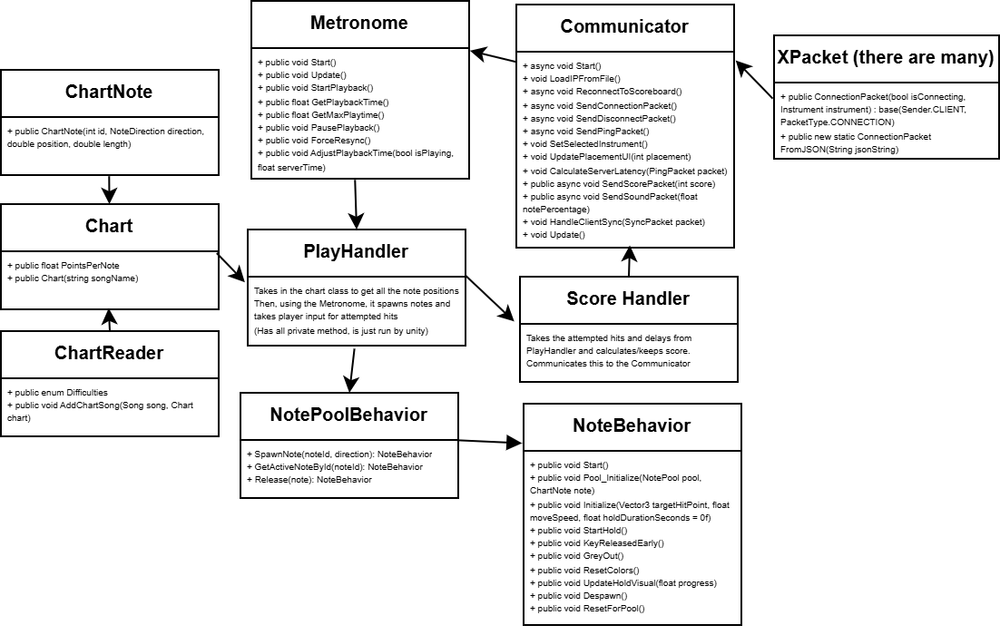

# Helium Bubble: Rhythm Jam
Our experimental multiplayer rhythm game! Currently only works as a multiplayer experence while running the score board script here: https://github.com/evanrg/helium-bubble-web-server/

## What it is
Helium Bubble: Rhythm Jam is a multiplayer rhythm game that has you playing an instrument in a band. Each player selects one of 5 instruments, Drums, Keyboard, Guitar, Bass, and Piano. Then, you will be playing the rhythm that aligns with that instrument. But the cool part is, the better or worse you do, the louder or quieter that instrument gets!

# Architecture Overview
  

### Structure Overview
Our game has three main parts. The initialization / chart reading, the gameplay and visuals, and the communication with the scoreboard. The initialization happens on the main menu screen where the user selects the instrument and starting difficulty. The chart reader goes in and reads all the necessary notes from the chart file and saves those to the Chart data structure. This Chart object is passed onto the PlayHandler which is the main control point for the gameplay and visuals. The Playhandler starts up the Metronome which then talks to the Communicator which in turn communicates with the scoreboard to sync the timing. The reason we have this structure is, the metronome can hold time by itself without needing the communicator therefore we don't need to be constantly sending pings to the server to know the current time.

### Notepool Adendum
Because our game spawns many notes per second, if we were to spawn the notes as Unity game objects each time a new note needs to spawn, the game would be very choppy. That's why we implemented a pool of notes that pregenerates 20 of each note type and then can place them in off screen when they are about to be 'spawned'. This allows for a reduced lag experience which matters a lot in a rhythm game with timing
